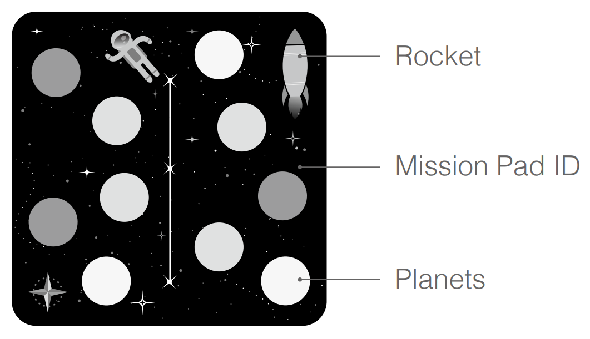
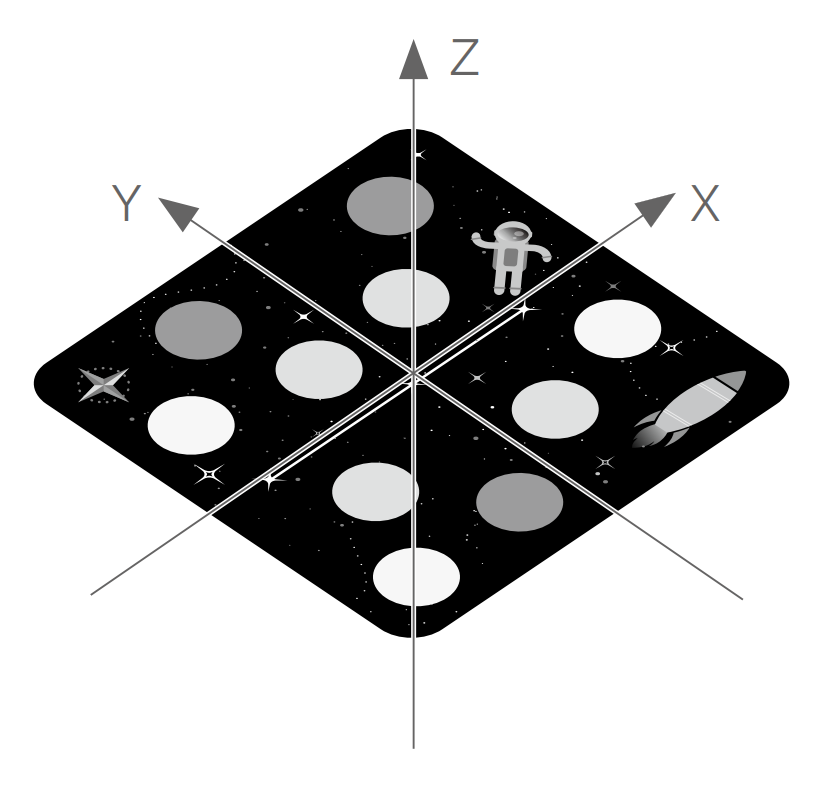
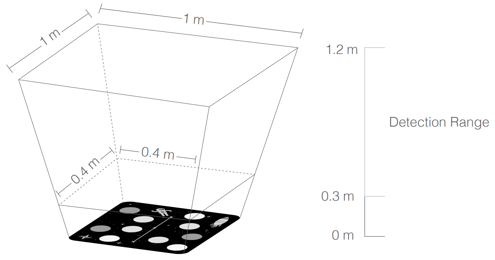

* [DJITelloPy](https://github.com/Hellsingoff/DJITelloPy#djitellopy) - о библиотеке.
    * [Tello](https://github.com/Hellsingoff/DJITelloPy#tello) - управление одним дроном.
        * [Методы класса Tello](https://github.com/Hellsingoff/DJITelloPy#%D0%BC%D0%B5%D1%82%D0%BE%D0%B4%D1%8B-%D0%BA%D0%BB%D0%B0%D1%81%D1%81%D0%B0-tello)
        * [Поля класса Tello](https://github.com/Hellsingoff/DJITelloPy#%D0%BF%D0%BE%D0%BB%D1%8F-%D0%BA%D0%BB%D0%B0%D1%81%D1%81%D0%B0-tello)
        * Примеры (TODO)
    * [TelloSwarm](https://github.com/Hellsingoff/DJITelloPy#telloswarm) - управление роем.
        * [Методы класса TelloSwarm](https://github.com/Hellsingoff/DJITelloPy#%D0%BC%D0%B5%D1%82%D0%BE%D0%B4%D1%8B-%D0%BA%D0%BB%D0%B0%D1%81%D1%81%D0%B0-telloswarm)
        * [Применение к TelloSwarm методов Tello](https://github.com/Hellsingoff/DJITelloPy#%D0%BF%D1%80%D0%B8%D0%BC%D0%B5%D0%BD%D0%B5%D0%BD%D0%B8%D0%B5-%D0%BA-telloswarm-%D0%BC%D0%B5%D1%82%D0%BE%D0%B4%D0%BE%D0%B2-tello)
        * [Поля класса TelloSwarm](https://github.com/Hellsingoff/DJITelloPy#%D0%BF%D0%BE%D0%BB%D1%8F-%D0%BA%D0%BB%D0%B0%D1%81%D1%81%D0%B0-telloswarm)
        * Примеры (TODO)
    * [Авторы](https://github.com/Hellsingoff/DJITelloPy#%D0%B0%D0%B2%D1%82%D0%BE%D1%80%D1%8B)
    * [Лицензия](https://github.com/Hellsingoff/DJITelloPy#%D0%BB%D0%B8%D1%86%D0%B5%D0%BD%D0%B7%D0%B8%D1%8F)
* [DJI Tello] - о дронах.
    * [Комплектация]
    * [Техника безопасности]
    * [Хранение]
    * [Mission Pad](https://github.com/Hellsingoff/DJITelloPy#mission-pad)
    * [Установка Python, pip, DJITelloPy]
    * [Объединение в рой]

# DJITelloPy
DJITelloPy - библиотека для Python 3.5 и выше, реализующая все команды, доступные в официальном [Tello SDK](https://dl-cdn.ryzerobotics.com/downloads/tello/20180910/Tello%20SDK%20Documentation%20EN_1.3.pdf) и [Tello EDU SDK](https://dl-cdn.ryzerobotics.com/downloads/Tello/Tello%20SDK%202.0%20User%20Guide.pdf). Некоторые функции становятся более понятными после изучения инструкции по [Mission Pad](https://dl-cdn.ryzerobotics.com/downloads/Tello/Tello%20Mission%20Pad%20User%20Guide.pdf).

Установка через pip
```
pip3 install https://github.com/Hellsingoff/DJITelloPy/archive/master.zip
```
## Tello

**Tello** - класс, реализующий управление одним дроном.
____
### Методы класса Tello
* [\_\_init\_\_(host=TELLO_IP, retry_count=RETRY_COUNT)](https://github.com/Hellsingoff/DJITelloPy#__init__hosttello_ip-retry_countretry_count) - инициализация объекта класса Tello.
* [connect()](https://github.com/Hellsingoff/DJITelloPy#connect) - подключение к дрону.
* [connect_to_wifi(ssid, password)](https://github.com/Hellsingoff/DJITelloPy#connect_to_wifissid-password) - подключение к Wi-Fi. (Только Tello EDU)
* [curve_xyz_speed(x1, y1, z1, x2, y2, z2, speed)](https://github.com/Hellsingoff/DJITelloPy#curve_xyz_speedx1-y1-z1-x2-y2-z2-speed) - полёт по дуге.
* [curve_xyz_speed_mid(x1, y1, z1, x2, y2, z2, speed, mid)](https://github.com/Hellsingoff/DJITelloPy#curve_xyz_speed_midx1-y1-z1-x2-y2-z2-speed-mid) - полет по дуге относительно Mission Pad. (Только Tello EDU)
* [disable_mission_pads()](https://github.com/Hellsingoff/DJITelloPy#disable_mission_pads) - отключить поиск Mission Pad. (Только Tello EDU)
* [emergency()](https://github.com/Hellsingoff/DJITelloPy#emergency) - экстренная остановка двигателей.
* [enable_mission_pads()](https://github.com/Hellsingoff/DJITelloPy#enable_mission_pads) - включить поиск Mission Pad. (Только Tello EDU)
* [end()](https://github.com/Hellsingoff/DJITelloPy#end) - завершение работы с дроном.
* [flip(direction)](https://github.com/Hellsingoff/DJITelloPy#flipdirection) - кувырок.
* [flip_back()](https://github.com/Hellsingoff/DJITelloPy#flip_back) - кувырок назад.
* [flip_forward()](https://github.com/Hellsingoff/DJITelloPy#flip_forward) - кувырок вперед.
* [flip_left()](https://github.com/Hellsingoff/DJITelloPy#flip_left) - кувырок влево.
* [flip_right()](https://github.com/Hellsingoff/DJITelloPy#flip_right) - кувырок вправо.
* [get_acceleration_x()](https://github.com/Hellsingoff/DJITelloPy#get_acceleration_x) - показания акселерометра по X.
* [get_acceleration_y()](https://github.com/Hellsingoff/DJITelloPy#get_acceleration_y) - показания акселерометра по Y.
* [get_acceleration_z()](https://github.com/Hellsingoff/DJITelloPy#get_acceleration_z) - показания акселерометра по Z.
* [get_barometer()](https://github.com/Hellsingoff/DJITelloPy#get_barometer) - показания альтиметра.
* [get_battery()](https://github.com/Hellsingoff/DJITelloPy#get_battery) - уровень заряда аккумулятора.
* [get_current_state()](https://github.com/Hellsingoff/DJITelloPy#get_current_state) - показатели всех датчиков дрона.
* [get_distance_tof()](https://github.com/Hellsingoff/DJITelloPy#get_distance_tof) - дистанция до препятствия снизу.
* [get_flight_time()](https://github.com/Hellsingoff/DJITelloPy#get_flight_time) - время работы моторов.
* [get_frame_read()](https://github.com/Hellsingoff/DJITelloPy#get_frame_read) - доступ к передней камере.
* [get_height()](https://github.com/Hellsingoff/DJITelloPy#get_height) - высота по координатной оси.
* [get_highest_temperature()](https://github.com/Hellsingoff/DJITelloPy#get_highest_temperature) - наивысшая температура.
* [get_lowest_temperature()](https://github.com/Hellsingoff/DJITelloPy#get_lowest_temperature) - самая низкая температура.
* [get_mission_pad_distance_x()](https://github.com/Hellsingoff/DJITelloPy#get_mission_pad_distance_x) - расстояние до Mission Pad по X. (Только Tello EDU)
* [get_mission_pad_distance_y()](https://github.com/Hellsingoff/DJITelloPy#get_mission_pad_distance_y) - расстояние до Mission Pad по Y. (Только Tello EDU)
* [get_mission_pad_distance_z()](https://github.com/Hellsingoff/DJITelloPy#get_mission_pad_distance_z) - расстояние до Mission Pad по Z. (Только Tello EDU)
* [get_mission_pad_id()](https://github.com/Hellsingoff/DJITelloPy#get_mission_pad_id) - ID определенного Mission Pad. (Только Tello EDU)
* [get_pitch()](https://github.com/Hellsingoff/DJITelloPy#get_pitch) - угол наклона по X.
* [get_roll()](https://github.com/Hellsingoff/DJITelloPy#get_roll) - угол наклона по Y.
* [get_speed_x()](https://github.com/Hellsingoff/DJITelloPy#get_speed_x) - скорость по X.
* [get_speed_y()](https://github.com/Hellsingoff/DJITelloPy#get_speed_y) - скорость по Y.
* [get_speed_z()](https://github.com/Hellsingoff/DJITelloPy#get_speed_z) - скорость по Z.
* [get_state_field(key)](https://github.com/Hellsingoff/DJITelloPy#get_state_fieldkey) - считать определенные данные дрона.
* [get_temperature()](https://github.com/Hellsingoff/DJITelloPy#get_temperature) - средняя температура дрона.
* [get_udp_video_address()](https://github.com/Hellsingoff/DJITelloPy#get_udp_video_address) - получить UDP адрес видео. (Внутренний метод библиотеки)
* [get_video_capture()](https://github.com/Hellsingoff/DJITelloPy#get_video_capture) - получить объект VideoCapture. (Внутренний метод библиотеки)
* [get_yaw()](https://github.com/Hellsingoff/DJITelloPy#get_yaw) - угол поворота относительно Z.
* [go_xyz_speed(x, y, z, speed)](https://github.com/Hellsingoff/DJITelloPy#go_xyz_speedx-y-z-speed) - полет в относительные координаты.
* [go_xyz_speed_mid(x, y, z, speed, mid)](https://github.com/Hellsingoff/DJITelloPy#go_xyz_speed_midx-y-z-speed-mid) - полет относительно Mission Pad. (Только Tello EDU)
* [go_xyz_speed_yaw_mid(x, y, z, speed, yaw, mid1, mid2)](https://github.com/Hellsingoff/DJITelloPy#go_xyz_speed_yaw_midx-y-z-speed-yaw-mid1-mid2) - полет от одного Mission Pad до другого и поворот на относительный угол.
* [land()](https://github.com/Hellsingoff/DJITelloPy#land) - приземление.
* [move(direction, x)](https://github.com/Hellsingoff/DJITelloPy#movedirection-x) - полет по направлению.
* [move_back(x)](https://github.com/Hellsingoff/DJITelloPy#move_backx) - полет назад.
* [move_down(x)](https://github.com/Hellsingoff/DJITelloPy#move_downx) - полет вниз.
* [move_forward(x)](https://github.com/Hellsingoff/DJITelloPy#move_forwardx) - полет вперед.
* [move_left(x)](https://github.com/Hellsingoff/DJITelloPy#move_leftx) - полет влево.
* [move_right(x)](https://github.com/Hellsingoff/DJITelloPy#move_rightx) - полет вправо.
* [move_up(x)](https://github.com/Hellsingoff/DJITelloPy#move_upx) - полет вверх.
* [parse_state(state)](https://github.com/Hellsingoff/DJITelloPy#parse_statestate) - статический обработчик получаемой от дрона информации. (Внутренний метод библиотеки)
* [query_attitude()](https://github.com/Hellsingoff/DJITelloPy#query_attitude) - углы наклона.
* [query_barometer()](https://github.com/Hellsingoff/DJITelloPy#query_barometer) - показания альтиметра.
* [query_battery()](https://github.com/Hellsingoff/DJITelloPy#query_battery) - уровень заряда аккумулятора.
* [query_distance_tof()](https://github.com/Hellsingoff/DJITelloPy#query_distance_tof) - дистанция до препятствия снизу.
* [query_flight_time()](https://github.com/Hellsingoff/DJITelloPy#query_flight_time) - время работы моторов.
* [query_height()](https://github.com/Hellsingoff/DJITelloPy#query_height) - высота по координатной оси.
* [query_sdk_version()](https://github.com/Hellsingoff/DJITelloPy#query_sdk_version) - версия поддерживаемого SDK. (Только Tello EDU)
* [query_serial_number()](https://github.com/Hellsingoff/DJITelloPy#query_serial_number) - серийный номер дрона. (Только Tello EDU)
* [query_speed()](https://github.com/Hellsingoff/DJITelloPy#query_speed) - текущая настройка скорости.
* [query_temperature()](https://github.com/Hellsingoff/DJITelloPy#query_temperature) - температура дрона.
* [query_wifi_signal_noise_ratio()](https://github.com/Hellsingoff/DJITelloPy#query_wifi_signal_noise_ratio) - уровень приема сигнала.
* [rotate_clockwise(x)](https://github.com/Hellsingoff/DJITelloPy#rotate_clockwisex) - поворот по часовой стрелке.
* [rotate_counter_clockwise(x)](https://github.com/Hellsingoff/DJITelloPy#rotate_counter_clockwisex) - поворот против часовой стрелки.
* [rotate_mid(yaw=0)](https://github.com/Hellsingoff/DJITelloPy#rotate_midyaw0) - поворот относительно Mission Pad. (Только Tello EDU)
* [send_command_with_return(command, timeout=RESPONSE_TIMEOUT)](https://github.com/Hellsingoff/DJITelloPy#send_command_with_returncommand-timeoutresponse_timeout) - отправить команду и ждать ответ.
* [send_command_without_return(command)](https://github.com/Hellsingoff/DJITelloPy#send_command_without_returncommand) - отправить команду и не ждать ответ.
* [send_control_command(command, timeout=RESPONSE_TIMEOUT)](https://github.com/Hellsingoff/DJITelloPy#send_control_commandcommand-timeoutresponse_timeout) - отправить команду управления дроном. (Внутренний метод библиотеки)
* [send_rc_control(y, x, z, yaw_z)](https://github.com/Hellsingoff/DJITelloPy#send_rc_controly-x-z-yaw_z) - прямое управление направлением полета.
* [send_read_command(command)](https://github.com/Hellsingoff/DJITelloPy#send_read_commandcommand) - запрос данных дрона. (Внутренний метод библиотеки)
* [set_mission_pad_detection_direction(x)](https://github.com/Hellsingoff/DJITelloPy#set_mission_pad_detection_directionx) - направление поиска Mission Pad. (Только Tello EDU)
* [set_speed(x)](https://github.com/Hellsingoff/DJITelloPy#set_speedx) - настройка скорости полета.
* [set_wifi_credentials(ssid, password)](https://github.com/Hellsingoff/DJITelloPy#set_wifi_credentialsssid-password) - настройка точки доступа Wi-Fi.
* [stop()](https://github.com/Hellsingoff/DJITelloPy#stop) - остановка дрона.
* [streamoff()](https://github.com/Hellsingoff/DJITelloPy#streamoff) - выключить стрим видео.
* [streamon()](https://github.com/Hellsingoff/DJITelloPy#streamon) - включить стрим видео.
* [takeoff()](https://github.com/Hellsingoff/DJITelloPy#takeoff) - взлет.
* [udp_response_receiver()](https://github.com/Hellsingoff/DJITelloPy#udp_response_receiver) - обработчик ответов от дрона. (Внутренний метод библиотеки)
* [udp_state_receiver()](https://github.com/Hellsingoff/DJITelloPy#udp_state_receiver) - обработчик показаний датчиков дрона. (Внутренний метод библиотеки)
____
#### \_\_init\_\_(host=TELLO_IP, retry_count=RETRY_COUNT)
Инициализация объекта класса Tello.

По умолчанию инициализация не трует аргументов, при этом IP дрона используется стандартный - 192.168.10.1, как при подключении к дрону по Wi-Fi. 

Если дрон подключен к локальной сети - при инициализации класса нужно как аргумент указать строку, содержащую IP дрона.

Так же принимается второй необязательный аргумент - целое число, указывающее количество попыток [RETRY_COUNT](https://github.com/Hellsingoff/DJITelloPy#%D0%BF%D0%BE%D0%BB%D1%8F-%D0%BA%D0%BB%D0%B0%D1%81%D1%81%D0%B0-tello).
```python
from djitellopy import Tello # импорт класса управления одним дроном

drone1 = Tello() # дрон по адресу 192.168.10.1

drone2 = Tello('192.168.1.220') # дрон по адресу 192.168.1.220

drone3 = Tello('192.168.1.245', 2) # дрон по адресу 192.168.1.245, количество попыток отправки команды - 2
```
____
#### connect()
Вход в режим управления командами.
```python
from djitellopy import Tello # импорт класса управления одним дроном

drone = Tello() # дрон по адресу 192.168.10.1

drone.connect() # подключение

drone.end() # удаляет drone
```
____
#### connect_to_wifi(ssid, password)
Подключение дрона к существующей локальной сети по Wi-Fi.

Команда поддерживается только Tello EDU.

Первый аргумент - имя сети (строка), второй аргумент - её пароль (строка).

Имя сети и пароль не должны содержать пробелов.

После выполнения команды дрон перезагрузится и подключится к указанной сети.

Для сброса настроек Wi-Fi надо включить дрон и пять секунд держать кнопку питания (до перезагрузки).
```python
from djitellopy import Tello # импорт класса управления одним дроном

drone = Tello() # дрон по адресу 192.168.10.1, мы подключились к создаваемой дроном точке доступа.

drone.connect() # подключение к дрону

drone.connect_to_wifi('example', 'pass') # дрон перезагрузится и подключится к точке example с паролем pass
```
____
#### curve_xyz_speed(x1, y1, z1, x2, y2, z2, speed)
Полёт по дуге (части окружности).

Летит в относительные координаты x2 y2 z2 через x1 y1 z1 со скоростью speed сантиметров в секунду.

Обе координаты указываются в сантиметрах относительно текущего положения, то есть дрон считается точкой начала координатных осей (0 0 0).

Движение по оси X - вперед. По оси Y - влево. По оси Z - вверх.

Координаты x2 y2 z2, x1 y1 z1 и текущее расположение дрона (координаты 0 0 0) должны находиться на окружности радиусом 0.5-10 метров.

Если такую окружность найти не удалось или её радиус не входит в допустимые значения - дрон отправит сообщение об ошибке и приземлится.
| Аргумент | Данные | Допустимые значения |
|:----------:|:------------------:|:--------:|
| x1 | int (сантиметры) | -500 - 500 |
| y1 | int (сантиметры) | -500 - 500 |
| z1 | int (сантиметры) | -500 - 500 |
| x2 | int (сантиметры) | -500 - 500 |
| y2 | int (сантиметры) | -500 - 500 |
| z2 | int (сантиметры) | -500 - 500 |
| speed | int (сантиметры в секунду) | 10 - 60 |
```python
from djitellopy import Tello # импорт класса управления одним дроном

drone = Tello() # дрон по адресу 192.168.10.1

drone.connect() # подключение

drone.takeoff() # взлёт

drone.curve_xyz_speed(100, 100, 0, 200, 0, 0, 60) # полёт по полуокружности

drone.land() # приземление

drone.end() # удаляет drone
```
Визуализация примера выше:


____
#### curve_xyz_speed_mid(x1, y1, z1, x2, y2, z2, speed, mid)
Полёт по дуге (части окружности) относительно Mission pad (коврика).

Передней камерой можно определить Mission Pad, но любые команды передвижения работают только относительно Mission Pad, определенных нижней камерой.

Команда поддерживается только в Tello EDU.

Необходимо чтобы был активен поиск Mission Pad с помощью [enable_mission_pads()](https://github.com/Hellsingoff/DJITelloPy#enable_mission_pads), а так же чтобы Mission Pad находился в области видимости камеры дрона. (TODO ссылка на область камеры)

Если обнаруживает коврик mid, летит в относительные координаты x2 y2 z2 через x1 y1 z1 со скоростью speed сантиметров в секунду, иначе - выводит ошибку и приземляется.

Обе координаты указываются в сантиметрах относительно положения Mission Pad, то есть Mission Pad считается точкой начала координатных осей (0 0 0).

Движение по оси X - вперед (куда указывает ракета). По оси Y - влево относительно ракеты. По оси Z - вверх от Mission Pad.

Координаты x2 y2 z2, x1 y1 z1 и Mission Pad (координаты 0 0 0) должны находиться на окружности радиусом 0.5-10 метров.

Если такую окружность найти не удалось или её радиус не входит в допустимые значения - дрон отправит сообщение об ошибке и приземлится.
| Аргумент | Данные | Допустимые значения |
|:----------:|:------------------:|:--------:|
| x1 | int (сантиметры) | -500 - 500 |
| y1 | int (сантиметры) | -500 - 500 |
| z1 | int (сантиметры) | -500 - 500 |
| x2 | int (сантиметры) | -500 - 500 |
| y2 | int (сантиметры) | -500 - 500 |
| z2 | int (сантиметры) | -500 - 500 |
| speed | int (сантиметры в секунду) | 10 - 60 |
| mid | int (Mission Pad ID) | 1 - 8 |
```python
from djitellopy import Tello # импорт класса управления одним дроном

drone = Tello() # дрон по адресу 192.168.10.1

drone.connect() # подключение

drone.takeoff() # взлёт

drone.curve_xyz_speed_mid(100, 100, 0, 200, 0, 0, 60, 1) # полёт по полуокружности, если найден MP1

drone.land() # приземление

drone.end() # удаляет drone
```
Визуализация примера выше:


____
#### disable_mission_pads()
Отключает определение Mission Pad.

Команда поддерживается только в Tello EDU.
```python
from djitellopy import Tello # импорт класса управления одним дроном

drone = Tello() # дрон по адресу 192.168.10.1

drone.connect() # подключение

drone.enable_mission_pads() # включаем функцию определения MP

drone.disable_mission_pads() # отключаем функцию определения MP

drone.end() # удаляет drone
```
____
#### emergency()
Экстренная остановка моторов.

Использовать осторожно, во время полёта это неизбежно приведет к падению дрона.
```python
from djitellopy import Tello # импорт класса управления одним дроном

drone = Tello() # дрон по адресу 192.168.10.1

drone.connect() # подключение

drone.takeoff() # взлёт

drone.emergency() # экстренная остановка моторов

drone.end() # удаляет drone
```
____
#### enable_mission_pads()
Активация поиска Mission Pad.

Команда поддерживается только в Tello EDU.
```python
from djitellopy import Tello # импорт класса управления одним дроном

drone = Tello() # дрон по адресу 192.168.10.1

drone.connect() # подключение

drone.enable_mission_pads() # включаем функцию определения MP

drone.disable_mission_pads() # отключаем функцию определения MP

drone.end() # удаляет drone
```
____
#### end()
Завершение работы с дроном. 

Если дрон в воздухе - он приземляется. Так же отключается стрим видео.

Удаляет объект дрона из памяти.
```python
from djitellopy import Tello # импорт класса управления одним дроном

drone = Tello() # дрон по адресу 192.168.10.1

drone.connect() # подключение

drone.takeoff() # взлёт

drone.end() # приземление, удаляет drone
```
____
#### flip(direction)
Сделать кувырок.

Кувырки могут не работать при заряде аккумулятора ниже 50%.

Требуется аргумент - направление кувырка (строка).
| Аргумент | Действие |
|:--------:|:------------------:|
| 'f' | Кувырок вперед |
| 'b' | Кувырок назад |
| 'l' | Кувырок влево |
| 'r' | Кувырок вправо |
```python
from djitellopy import Tello # импорт класса управления одним дроном

drone = Tello() # дрон по адресу 192.168.10.1

drone.connect() # подключение

drone.takeoff() # взлёт

drone.flip('l') # кувырок влево

drone.flip('r') # кувырок вправо

drone.flip('f') # кувырок вперед

drone.flip('b') # кувырок назад

drone.land() # приземление

drone.end() # удаляет drone
```
____
#### flip_back()
Кувырок назад.
```python
from djitellopy import Tello # импорт класса управления одним дроном

drone = Tello() # дрон по адресу 192.168.10.1

drone.connect() # подключение

drone.takeoff() # взлёт

drone.flip_back() # кувырок назад

drone.land() # приземление

drone.end() # удаляет drone
```
____
#### flip_forward()
Кувырок вперед.
```python
from djitellopy import Tello # импорт класса управления одним дроном

drone = Tello() # дрон по адресу 192.168.10.1

drone.connect() # подключение

drone.takeoff() # взлёт

drone.flip_forward() # кувырок вперед

drone.land() # приземление

drone.end() # удаляет drone
```
____
#### flip_left()
Кувырок влево.
```python
from djitellopy import Tello # импорт класса управления одним дроном

drone = Tello() # дрон по адресу 192.168.10.1

drone.connect() # подключение

drone.takeoff() # взлёт

drone.flip_left() # кувырок влево

drone.land() # приземление

drone.end() # удаляет drone
```
____
#### flip_right()
Кувырок вправо.
```python
from djitellopy import Tello # импорт класса управления одним дроном

drone = Tello() # дрон по адресу 192.168.10.1

drone.connect() # подключение

drone.takeoff() # взлёт

drone.flip_right() # кувырок вправо

drone.land() # приземление

drone.end() # удаляет drone
```
____
#### get_acceleration_x()
Запросить показания акселерометра по оси X.

Возвращает float.
```python
from djitellopy import Tello # импорт класса управления одним дроном

drone = Tello() # дрон по адресу 192.168.10.1

drone.connect() # подключение

drone.takeoff() # взлёт

print(drone.get_acceleration_x()) # выводит значение ускорения по X

drone.land() # приземление

drone.end() # удаляет drone
```
____
#### get_acceleration_y()

Запросить показания акселерометра по оси Y.

Возвращает float.
```python
from djitellopy import Tello # импорт класса управления одним дроном

drone = Tello() # дрон по адресу 192.168.10.1

drone.connect() # подключение

drone.takeoff() # взлёт

print(drone.get_acceleration_y()) # выводит значение ускорения по Y

drone.land() # приземление

drone.end() # удаляет drone
```
____
#### get_acceleration_z()
Запросить показания акселерометра по оси Z.

Возвращает float.
```python
from djitellopy import Tello # импорт класса управления одним дроном

drone = Tello() # дрон по адресу 192.168.10.1

drone.connect() # подключение

drone.takeoff() # взлёт

print(drone.get_acceleration_z()) # выводит значение ускорения по Z

drone.land() # приземление

drone.end() # удаляет drone
```
____
#### get_barometer()
Запросить у дрона показания встроенного альтиметра.

Показания не очень точные.

Возвращает float - глобальную высоту в сантиметрах.
```python
from djitellopy import Tello # импорт класса управления одним дроном

drone = Tello() # дрон по адресу 192.168.10.1

drone.connect() # подключение

print(drone.get_barometer()) # выводит показания альтиметра

drone.end() # удаляет drone
```
____
#### get_battery()
Запросить уровень заряда аккумулятора.

Возвращает целое число процентов (0 - 100).
```python
from djitellopy import Tello # импорт класса управления одним дроном

drone = Tello() # дрон по адресу 192.168.10.1

drone.connect() # подключение

print(drone.get_battery()) # выводит уровень заряда аккумулятора

drone.end() # удаляет drone
```
____
#### get_current_state()
Запросить все показатели дрона.

Возвращает словарь:
| Ключ | Тип данных | Значение |
|:----:|:----------:|:--------:|
| pitch | int (градусы) | Наклон по X |
| roll | int (градусы) | Наклон по Y |
| yaw | int (градусы) | Поворот по Z |
| vgx | int (см/с) | Скорость по X |
| vgy | int (см/с) | Скорость по Y |
| vgz | int (см/с) | Скорость по Z |
| templ | int (°C) | Самая низкая, на данный момент, температура дрона |
| temph | int (°C) | Самая высокая, на данный момент, температура дрона |
| tof | int (сантиметры) | Показатель датчика расстояния до препятствия снизу |
| h | int (сантиметры) | Высота относительно координатной оси |
| bat | int (проценты) | Уровень заряда аккумулятора |
| baro | float (сантиметры) | Показания альтиметра |
| time | int (секунды) | Время полёта с последнего взлёта |
| agx | float | Данные акселерометра по оси X |
| agy | float | Данные акселерометра по оси Y |
| agz | float | Данные акселерометра по оси Z |
| mid | int (номер) | ID найденного Mission Pad.<br>Поддерживается только в Tello EDU. |
| x | int (сантиметры) | Расстояние до найденного Mission Pad по оси X относительно дрона.<br>Поддерживается только в Tello EDU. |
| y | int (сантиметры) | Расстояние до найденного Mission Pad по оси Y относительно дрона.<br>Поддерживается только в Tello EDU. |
| z | int (сантиметры) | Расстояние до найденного Mission Pad по оси Z относительно дрона.<br>Поддерживается только в Tello EDU. |
| mpry | str (особый формат) | Углы между Mission Pad и дроном в формате 'x,y,z'.<br>Поддерживается только в Tello EDU. |
```python
from djitellopy import Tello # импорт класса управления одним дроном

drone = Tello() # дрон по адресу 192.168.10.1

drone.connect() # подключение

print(drone.get_current_state()) # выводит весь словарь в "сыром" виде

# выводит весь словарь построчно:
state = drone.get_current_state()
for key in state:
    print(f'{key}: {state[key]}')

# вывод значения поля 'mpry'
print(drone.get_current_state()['mpry'])

drone.end() # удаляет drone
```
____
#### get_distance_tof()
Запросить у дрона расстояние до препятствия снизу.

Возвращает int.
```python
from djitellopy import Tello # импорт класса управления одним дроном

drone = Tello() # дрон по адресу 192.168.10.1

drone.connect() # подключение

print(drone.get_distance_tof()) # выводит расстояние до препятствия снизу

drone.end() # удаляет drone
```
____
#### get_flight_time()
Запросить у дрона время полёта в секундах с момента последнего взлёта.

Возвращает int.
```python
from djitellopy import Tello # импорт класса управления одним дроном

drone = Tello() # дрон по адресу 192.168.10.1

drone.connect() # подключение

print(drone.get_flight_time()) # выводит время полета

drone.end() # удаляет drone
```
____
#### get_frame_read()
Получить объект BackgroundFrameRead для подключения к камере дрона.

Доступ к стриму можно получить только напрямую подключившись к дрону, режим подключения к локальной сети по Wi-Fi делает невозможным обращение по адресу видео потока дрона.

Предварительно необходимо включить стрим камеры командой [streamon()](https://github.com/Hellsingoff/DJITelloPy#streamon)

Позволяет получить в дальнейшем изображение с камеры.

Возвращает BackgroundFrameRead.
```python
import cv2 # импорт библиотеки компьютерного зрения для работы с камерой

from djitellopy import Tello # импорт класса управления одним дроном

drone = Tello() # дрон по адресу 192.168.10.1

drone.connect() # подключение

drone.streamon() # активация стрима камеры

drone_camera = drone.get_frame_read() # получаем объект доступа к камере

cv2.imwrite("picture.png", drone_camera.frame) # получить изображение с камеры и сохранить в файл picture.png

drone.streamoff() # отключение стрима

drone.end() # удаляет drone
```
____
#### get_height()
Запросить высоту дрона относительно оси координат в сантиметрах.

Возвращает int.
```python
from djitellopy import Tello # импорт класса управления одним дроном

drone = Tello() # дрон по адресу 192.168.10.1

drone.connect() # подключение

print(drone.get_height()) # выводит высоту дрона

drone.end() # удаляет drone
```
____
#### get_highest_temperature()
Запросить наивысшую, на данный момент, температуру дрона в °C.

Возвращает int.
```python
from djitellopy import Tello # импорт класса управления одним дроном

drone = Tello() # дрон по адресу 192.168.10.1

drone.connect() # подключение

print(drone.get_highest_temperature()) # выводит наивысшую температуру дрона

drone.end() # удаляет drone
```
____
#### get_lowest_temperature()
Запросить наименьшую, на данный момент, температуру дрона в °C.

Возвращает int.
```python
from djitellopy import Tello # импорт класса управления одним дроном

drone = Tello() # дрон по адресу 192.168.10.1

drone.connect() # подключение

print(drone.get_lowest_temperature()) # выводит наименьшую температуру дрона

drone.end() # удаляет drone
```
____
#### get_mission_pad_distance_x()
Запросить дистанцию по оси X до Mission Pad в сантиметрах.

Команда поддерживается только в Tello EDU.

Необходимо чтобы был активен поиск Mission Pad с помощью [enable_mission_pads()](https://github.com/Hellsingoff/DJITelloPy#enable_mission_pads), а так же чтобы какой-либо Mission Pad находился в области видимости камеры дрона. (TODO ссылка на область камеры)

Возвращает int.
```python
from djitellopy import Tello # импорт класса управления одним дроном

drone = Tello() # дрон по адресу 192.168.10.1

drone.connect() # подключение

print(drone.get_mission_pad_distance_x()) # выводит расстояние до MP по оси X

drone.end() # удаляет drone
```
____
#### get_mission_pad_distance_y()
Запросить дистанцию по оси Y до Mission Pad в сантиметрах.

Команда поддерживается только в Tello EDU.

Необходимо чтобы был активен поиск Mission Pad с помощью [enable_mission_pads()](https://github.com/Hellsingoff/DJITelloPy#enable_mission_pads), а так же чтобы какой-либо Mission Pad находился в области видимости камеры дрона. (TODO ссылка на область камеры)

Возвращает int.
```python
from djitellopy import Tello # импорт класса управления одним дроном

drone = Tello() # дрон по адресу 192.168.10.1

drone.connect() # подключение

print(drone.get_mission_pad_distance_y()) # выводит расстояние до MP по оси Y

drone.end() # удаляет drone
```
____
#### get_mission_pad_distance_z()
Запросить дистанцию по оси Z до Mission Pad в сантиметрах.

Команда поддерживается только в Tello EDU.

Необходимо чтобы был активен поиск Mission Pad с помощью [enable_mission_pads()](https://github.com/Hellsingoff/DJITelloPy#enable_mission_pads), а так же чтобы какой-либо Mission Pad находился в области видимости камеры дрона. (TODO ссылка на область камеры)

Возвращает int.
```python
from djitellopy import Tello # импорт класса управления одним дроном

drone = Tello() # дрон по адресу 192.168.10.1

drone.connect() # подключение

print(drone.get_mission_pad_distance_z()) # выводит расстояние до MP по оси Z

drone.end() # удаляет drone
```
____
#### get_mission_pad_id()
Запросить ID определенного камерой дрона Mission Pad.

Команда поддерживается только в Tello EDU.

Необходимо чтобы был активен поиск Mission Pad с помощью [enable_mission_pads()](https://github.com/Hellsingoff/DJITelloPy#enable_mission_pads), а так же чтобы какой-либо Mission Pad находился в области видимости камеры дрона. (TODO ссылка на область камеры)

Возвращает int.

Если Mission Pad не обнаружен - возвращает -1.
```python
from djitellopy import Tello # импорт класса управления одним дроном

drone = Tello() # дрон по адресу 192.168.10.1

drone.connect() # подключение

print(drone.get_mission_pad_id()) # выводит Mission Pad ID

drone.end() # удаляет drone
```
____
#### get_pitch()
Запросить наклон дрона по оси X в градусах.

Возвращает int.
```python
from djitellopy import Tello # импорт класса управления одним дроном

drone = Tello() # дрон по адресу 192.168.10.1

drone.connect() # подключение

print(drone.get_pitch()) # выводит угол

drone.end() # удаляет drone
```
____
#### get_roll()
Запросить наклон дрона по оси Y в градусах.

Возвращает int.
```python
from djitellopy import Tello # импорт класса управления одним дроном

drone = Tello() # дрон по адресу 192.168.10.1

drone.connect() # подключение

print(drone.get_roll()) # выводит угол

drone.end() # удаляет drone
```
____
#### get_speed_x()
Запросить текущую скорость по оси X в сантиметрах в секунду.

Возвращает int.
```python
from djitellopy import Tello # импорт класса управления одним дроном

drone = Tello() # дрон по адресу 192.168.10.1

drone.connect() # подключение

print(drone.get_speed_x()) # выводит скорость по оси X

drone.end() # удаляет drone
```
____
#### get_speed_y()
Запросить текущую скорость по оси Y в сантиметрах в секунду.

Возвращает int.
```python
from djitellopy import Tello # импорт класса управления одним дроном

drone = Tello() # дрон по адресу 192.168.10.1

drone.connect() # подключение

print(drone.get_speed_y()) # выводит скорость по оси Y

drone.end() # удаляет drone
```
____
#### get_speed_z()
Запросить текущую скорость по оси Z в сантиметрах в секунду.

Возвращает int.
```python
from djitellopy import Tello # импорт класса управления одним дроном

drone = Tello() # дрон по адресу 192.168.10.1

drone.connect() # подключение

print(drone.get_speed_z()) # выводит скорость по оси Z

drone.end() # удаляет drone
```
____
#### get_state_field(key)
Запросить у дрона значение определенного поля.

Аргумент - имя поля (строка).
| Ключ | Тип данных | Значение |
|:----:|:----------:|:--------:|
| pitch | int (градусы) | Наклон по X |
| roll | int (градусы) | Наклон по Y |
| yaw | int (градусы) | Поворот по Z |
| vgx | int (см/с) | Скорость по X |
| vgy | int (см/с) | Скорость по Y |
| vgz | int (см/с) | Скорость по Z |
| templ | int (°C) | Самая низкая, на данный момент, температура дрона |
| temph | int (°C) | Самая высокая, на данный момент, температура дрона |
| tof | int (сантиметры) | Показатель датчика расстояния до препятствия снизу |
| h | int (сантиметры) | Высота относительно координатной оси |
| bat | int (проценты) | Уровень заряда аккумулятора |
| baro | float (сантиметры) | Показания альтиметра |
| time | int (секунды) | Время полёта с последнего взлёта |
| agx | float | Данные акселерометра по оси X |
| agy | float | Данные акселерометра по оси Y |
| agz | float | Данные акселерометра по оси Z |
| mid | int (номер) | ID найденного Mission Pad.<br>Поддерживается только в Tello EDU. |
| x | int (сантиметры) | Расстояние до найденного Mission Pad по оси X относительно дрона.<br>Поддерживается только в Tello EDU. |
| y | int (сантиметры) | Расстояние до найденного Mission Pad по оси Y относительно дрона.<br>Поддерживается только в Tello EDU. |
| z | int (сантиметры) | Расстояние до найденного Mission Pad по оси Z относительно дрона.<br>Поддерживается только в Tello EDU. |
| mpry | str (особый формат) | Углы между Mission Pad и дроном в формате 'x,y,z'.<br>Поддерживается только в Tello EDU. |
```python
from djitellopy import Tello # импорт класса управления одним дроном

drone = Tello() # дрон по адресу 192.168.10.1

drone.connect() # подключение

print(drone.get_state_field('mpry')) # выводит значение поля 'mpry'

drone.end() # удаляет drone
```
____
#### get_temperature()
Запросить у дрона его среднюю температуру в °C.

Фактически является средним между минимальным и максимальным значением.

Возвращает float.
```python
from djitellopy import Tello # импорт класса управления одним дроном

drone = Tello() # дрон по адресу 192.168.10.1

drone.connect() # подключение

print(drone.get_temperature()) # выводит среднюю температуру

drone.end() # удаляет drone
```
____
#### get_udp_video_address()
Запросить у дрона UDP адрес видео.

Внутренний метод библиотеки. Скорее всего, он Вам не нужен.

Возвращает str.
____
#### get_video_capture()
Запросить у дрона объект VideoCapture.

Ещё один внутренний библиотеки. Скорее всего он Вам не нужен.

Возвращает VideoCapture.
____
#### get_yaw()
Запросить угол поворота дрона относительно оси Z в градусах.

Возвращает int.
```python
from djitellopy import Tello # импорт класса управления одним дроном

drone = Tello() # дрон по адресу 192.168.10.1

drone.connect() # подключение

print(drone.get_yaw()) # выводит угол

drone.end() # удаляет drone
```
____
#### go_xyz_speed(x, y, z, speed)
Полёт в координаты x y z со скоростью speed сантиметров в секунду.

За начало осей координат (0 0 0) берется текущее местоположение дрона.

Модуль хотя бы одной из координат x y z должен быть не менее 20, попытка лететь на меньшую дистанцию вызовет ошибку.

Допустимые значения аргументов:
| Аргумент | Данные | Допустимые значения |
|:----------:|:------------------:|:--------:|
| x | int (сантиметры) | -500 - 500 |
| y | int (сантиметры) | -500 - 500 |
| z | int (сантиметры) | -500 - 500 |
| speed | int (сантиметры в секунду) | 10 - 100 |
```python
from djitellopy import Tello # импорт класса управления одним дроном

drone = Tello() # дрон по адресу 192.168.10.1

drone.connect() # подключение

drone.takeoff() # взлёт

drone.go_xyz_speed(100, 0, 0, 100) # полёт на метр вперед со скоростью 100 см/с

drone.land() # приземление

drone.end() # удаляет drone
```
____
#### go_xyz_speed_mid(x, y, z, speed, mid)
Полёт в координаты x y z относительно Mission Pad mid со скоростью speed сантиметров в секунду.

Передней камерой можно определить Mission Pad, но любые команды передвижения работают только относительно Mission Pad, определенных нижней камерой.

Команда поддерживается только в Tello EDU.

За начало осей координат (0 0 0) берется Mission Pad.

Если Mission Pad с ID mid не обнаружен - выводит ошибку и приземляется.

Необходимо чтобы был активен поиск Mission Pad с помощью [enable_mission_pads()](https://github.com/Hellsingoff/DJITelloPy#enable_mission_pads), а так же чтобы Mission Pad находился в области видимости камеры дрона. (TODO ссылка на область камеры)

Модуль хотя бы одной из координат x y z должен быть не менее 20, попытка лететь на меньшую дистанцию вызовет ошибку.

Допустимые значения аргументов:
| Аргумент | Данные | Допустимые значения |
|:----------:|:------------------:|:--------:|
| x | int (сантиметры) | -500 - 500 |
| y | int (сантиметры) | -500 - 500 |
| z | int (сантиметры) | -500 - 500 |
| speed | int (сантиметры в секунду) | 10 - 100 |
| mid | int (Mission Pad ID) | 1 - 8 |
```python
from djitellopy import Tello # импорт класса управления одним дроном

drone = Tello() # дрон по адресу 192.168.10.1

drone.connect() # подключение

drone.takeoff() # взлёт

drone.go_xyz_speed(100, 0, 0, 100, 1) # полёт на метр вперед относительно MP1 со скоростью 100 см/с

drone.land() # приземление

drone.end() # удаляет drone
```
____
#### go_xyz_speed_yaw_mid(x, y, z, speed, yaw, mid1, mid2)
Полёт в координаты x y z относительно Mission Pad mid1 со скоростью speed сантиметров в секунду. В точке x y z производится поиск Mission Pad mid2 и дрон поворачивается на угол yaw относительно направления mid2.

Передней камерой можно определить Mission Pad, но любые команды передвижения работают только относительно Mission Pad, определенных нижней камерой.

Команда поддерживается только в Tello EDU.

За начало осей координат (0 0 0) берется Mission Pad mid1.

Если Mission Pad с ID mid1 не обнаружен - выводит ошибку и приземляется.

Если в точке x y z Mission Pad с ID mid2 не обнаружен - выводит ошибку и приземляется.

Неоднозначную работу команды может вызвать слишком близкое расположение двух Mission Pad. (TODO ссылка на область камеры)

Необходимо чтобы был активен поиск Mission Pad с помощью [enable_mission_pads()](https://github.com/Hellsingoff/DJITelloPy#enable_mission_pads), а так же чтобы Mission Pad находился в области видимости камеры дрона. (TODO ссылка на область камеры)

Модуль хотя бы одной из координат x y z должен быть не менее 20, попытка лететь на меньшую дистанцию вызовет ошибку.

Допустимые значения аргументов:
| Аргумент | Данные | Допустимые значения |
|:----------:|:------------------:|:--------:|
| x | int (сантиметры) | -500 - 500 |
| y | int (сантиметры) | -500 - 500 |
| z | int (сантиметры) | -500 - 500 |
| speed | int (сантиметры в секунду) | 10 - 100 |
| yaw | int (градусы) | -360 - 360 |
| mid1 | int (Mission Pad ID) | 1 - 8 |
| mid2 | int (Mission Pad ID) | 1 - 8 |
```python
from djitellopy import Tello # импорт класса управления одним дроном

drone = Tello() # дрон по адресу 192.168.10.1

drone.connect() # подключение

drone.takeoff() # взлёт

# полёт от MP1 на метр вперед (по направлению ракеты на коврике) со скоростью 100 см/с
# после производится поиск MP2 и такой поворот дрона, чтобы разница между направлением дрона и ракетой на MP2 составила 0 градусов
drone.go_xyz_speed(100, 0, 0, 100, 0, 1, 2)

drone.land() # приземление

drone.end() # удаляет drone
```
____
#### land()
Приземление дрона.
```python
from djitellopy import Tello # импорт класса управления одним дроном

drone = Tello() # дрон по адресу 192.168.10.1

drone.connect() # подключение

drone.takeoff() # взлёт

drone.land() # приземление

drone.end() # удаляет drone
```
____
#### move(direction, x)
Полёт дрона параллельно координатным осям - вперед/назад (ось X), влево/вправо (ось Y), вверх/вниз (ось Z).

Требуется два аргумента - направление (str) и расстояние в сантиметрах (int).

Расстояние должно быть не менее 20 сантиметров, попытка полёта на меньшую диистанцию вызовет ошибку.

Допустимые значения аргументов:
| Аргумент | Данные | Допустимые значения |
|:----------:|:------------------:|:--------:|
| direction | str (направление) | 'forward', 'back', 'left', 'right', 'up', 'down' |
| x | int (сантиметры) | 20 - 500 |

Значение аргументов направления:
| Аргумент | Направление |
|:--------:|:------------------:|
| 'forward' | Полет вперед |
| 'back' | Полет назад |
| 'left' | Полет влево |
| 'right' | Полет вправо |
| 'up' | Полет вверх |
| 'down' | Полет вниз |
```python
from djitellopy import Tello # импорт класса управления одним дроном

drone = Tello() # дрон по адресу 192.168.10.1

drone.connect() # подключение

drone.takeoff() # взлёт

drone.move('forward', 50) # полет вперед на 50 сантиметров

drone.move('back', 50) # полет назад на 50 сантиметров

drone.move('left', 50) # полет влево на 50 сантиметров

drone.move('right', 50) # полет вправо на 50 сантиметров

drone.move('up', 50) # полет вверх на 50 сантиметров

drone.move('down', 50) # полет вниз на 50 сантиметров

drone.land() # приземление

drone.end() # удаляет drone
```
____
#### move_back(x)
Полет назад на x сантиметров.

Принимает один аргумент - целое число от 20 до 500.
```python
from djitellopy import Tello # импорт класса управления одним дроном

drone = Tello() # дрон по адресу 192.168.10.1

drone.connect() # подключение

drone.takeoff() # взлёт

drone.move_back(50) # полет назад на 50 сантиметров

drone.land() # приземление

drone.end() # удаляет drone
```
____
#### move_down(x)
Полет вниз на x сантиметров.

Принимает один аргумент - целое число от 20 до 500.
```python
from djitellopy import Tello # импорт класса управления одним дроном

drone = Tello() # дрон по адресу 192.168.10.1

drone.connect() # подключение

drone.takeoff() # взлёт

drone.move_down(50) # полет вниз на 50 сантиметров

drone.land() # приземление

drone.end() # удаляет drone
```
____
#### move_forward(x)
Полет вперед на x сантиметров.

Принимает один аргумент - целое число от 20 до 500.
```python
from djitellopy import Tello # импорт класса управления одним дроном

drone = Tello() # дрон по адресу 192.168.10.1

drone.connect() # подключение

drone.takeoff() # взлёт

drone.move_forward(50) # полет вперед на 50 сантиметров

drone.land() # приземление

drone.end() # удаляет drone
```
____
#### move_left(x)
Полет влево на x сантиметров.

Принимает один аргумент - целое число от 20 до 500.
```python
from djitellopy import Tello # импорт класса управления одним дроном

drone = Tello() # дрон по адресу 192.168.10.1

drone.connect() # подключение

drone.takeoff() # взлёт

drone.move_left(50) # полет влево на 50 сантиметров

drone.land() # приземление

drone.end() # удаляет drone
```
____
#### move_right(x)
Полет вправо на x сантиметров.

Принимает один аргумент - целое число от 20 до 500.
```python
from djitellopy import Tello # импорт класса управления одним дроном

drone = Tello() # дрон по адресу 192.168.10.1

drone.connect() # подключение

drone.takeoff() # взлёт

drone.move_right(50) # полет вправо на 50 сантиметров

drone.land() # приземление

drone.end() # удаляет drone
```
____
#### move_up(x)
Полет вверх на x сантиметров.

Принимает один аргумент - целое число от 20 до 500.
```python
from djitellopy import Tello # импорт класса управления одним дроном

drone = Tello() # дрон по адресу 192.168.10.1

drone.connect() # подключение

drone.takeoff() # взлёт

drone.move_up(50) # полет вверх на 50 сантиметров

drone.land() # приземление

drone.end() # удаляет drone
```
____
#### parse_state(state)
Статический внутренний метод библиотеки для обработки данных, полученных от дрона. Он Вам не нужен.

Принимает один аргумент - строку с данными в особом формате.

Возвращает словарь.
____
#### query_attitude()
Запрашивает у дрона данные о его наклоне по осям X/Y и повороте относительно оси Z.

Работает медленнее, чем запросы [get_pitch()](https://github.com/Hellsingoff/DJITelloPy#get_pitch), [get_roll()](https://github.com/Hellsingoff/DJITelloPy#get_roll) и [get_yaw()](https://github.com/Hellsingoff/DJITelloPy#get_yaw), предоставляющих те же данные.

Возвращает словарь:
| Ключ | Данные | Значение |
|:----:|:------:|:--------:|
| 'pitch' | int (градус) | Наклон по оси X |
| 'roll' | int (градус) | Наклон по оси Y |
| 'yaw' | int (градус) | Поворот относительно оси Z |
```python
from djitellopy import Tello # импорт класса управления одним дроном

drone = Tello() # дрон по адресу 192.168.10.1

drone.connect() # подключение

print(drone.query_attitude()) # выводит весь словарь в "сыром" виде

# выводит весь словарь построчно:
attitude = drone.query_attitude()
for key in attitude:
    print(f'{key}: {attitude[key]}')

# вывод наклона по оси X (результат полностью идентичен get_pitch(), но работает медленнее)
print(drone.query_attitude()['pitch'])

drone.end() # удаляет drone
```
____
#### query_barometer()
Запросить у дрона показания встроенного альтиметра.

Работает медленнее запроса [get_barometer()](https://github.com/Hellsingoff/DJITelloPy#get_barometer), предоставляющего те же данные.

Показания не очень точные.

Возвращает float - глобальную высоту в сантиметрах.
```python
from djitellopy import Tello # импорт класса управления одним дроном

drone = Tello() # дрон по адресу 192.168.10.1

drone.connect() # подключение

print(drone.query_barometer()) # выводит показания альтиметра

drone.end() # удаляет drone
```
____
#### query_battery()
Запрашивает у дрона уровень заряда аккумулятора в процентах.

Работает медленнее запроса [get_battery()](https://github.com/Hellsingoff/DJITelloPy#get_battery), предоставляющего те же данные.

Возвращает int.
```python
from djitellopy import Tello # импорт класса управления одним дроном

drone = Tello() # дрон по адресу 192.168.10.1

drone.connect() # подключение

print(drone.query_battery()) # выводит заряд аккумулятора

drone.end() # удаляет drone
```
____
#### query_distance_tof()
Запрашивает у дрона расстояние до препятствия снизу в сантиметрах.

Работает медленнее запроса [get_distance_tof()](https://github.com/Hellsingoff/DJITelloPy#get_distance_tof), предоставляющего те же данные.

Возвращает int.
```python
from djitellopy import Tello # импорт класса управления одним дроном

drone = Tello() # дрон по адресу 192.168.10.1

drone.connect() # подключение

drone.takeoff() # взлет

print(drone.query_distance_tof()) # выводит расстояние до препятствия снизу

drone.land() # приземление

drone.end() # удаляет drone
```
____
#### query_flight_time()
Запрашивает у дрона время с начала текущего полета в секундах.

Работает медленнее запроса [get_flight_time()](https://github.com/Hellsingoff/DJITelloPy#get_flight_time), предоставляющего те же данные.

Возвращает int.
```python
from djitellopy import Tello # импорт класса управления одним дроном

drone = Tello() # дрон по адресу 192.168.10.1

drone.connect() # подключение

drone.takeoff() # взлет

print(drone.query_flight_time()) # выводит время полета

drone.land() # приземление

drone.end() # удаляет drone
```
____
#### query_height()
Запрашивает у дрона высоту относительно координатной оси в сантиметрах.

Работает медленнее запроса [get_height()](https://github.com/Hellsingoff/DJITelloPy#get_height), предоставляющего те же данные.

Возвращает int.
```python
from djitellopy import Tello # импорт класса управления одним дроном

drone = Tello() # дрон по адресу 192.168.10.1

drone.connect() # подключение

drone.takeoff() # взлет

print(drone.query_height()) # выводит высоту

drone.land() # приземление

drone.end() # удаляет drone
```
____
#### query_sdk_version()
Запрашивает у дрона версию поддерживаемого набора команд.

Работает только на Tello EDU.

SDK 2.0 предоставляет дополнительный функционал:
* Работа с Mission Pad:
    * [curve_xyz_speed_mid(x1, y1, z1, x2, y2, z2, speed, mid)](https://github.com/Hellsingoff/DJITelloPy#curve_xyz_speed_midx1-y1-z1-x2-y2-z2-speed-mid)
    * [disable_mission_pads()](https://github.com/Hellsingoff/DJITelloPy#disable_mission_pads)
    * [enable_mission_pads()](https://github.com/Hellsingoff/DJITelloPy#enable_mission_pads)
    * [get_mission_pad_distance_x()](https://github.com/Hellsingoff/DJITelloPy#get_mission_pad_distance_x)
    * [get_mission_pad_distance_y()](https://github.com/Hellsingoff/DJITelloPy#get_mission_pad_distance_y)
    * [get_mission_pad_distance_z()](https://github.com/Hellsingoff/DJITelloPy#get_mission_pad_distance_z)
    * [get_mission_pad_id()](https://github.com/Hellsingoff/DJITelloPy#get_mission_pad_id)
    * [go_xyz_speed_mid(x, y, z, speed, mid)](https://github.com/Hellsingoff/DJITelloPy#go_xyz_speed_midx-y-z-speed-mid)
    * [go_xyz_speed_yaw_mid(x, y, z, speed, yaw, mid1, mid2)](https://github.com/Hellsingoff/DJITelloPy#go_xyz_speed_yaw_midx-y-z-speed-yaw-mid1-mid2)
* Подключение к локальной сети:
    * [connect_to_wifi(ssid, password)](https://github.com/Hellsingoff/DJITelloPy#connect_to_wifissid-password)
* Дополнительные поля для данных обнаруженного Mission Pad:
    * [get_current_state()](https://github.com/Hellsingoff/DJITelloPy#get_current_state)
    * [get_state_field(key)](https://github.com/Hellsingoff/DJITelloPy#get_state_fieldkey)
* Дополнительные команды:
    * [query_sdk_version()](https://github.com/Hellsingoff/DJITelloPy#query_sdk_version)
    * [query_serial_number()](https://github.com/Hellsingoff/DJITelloPy#query_serial_number)
    * [rotate_mid(yaw=0)](https://github.com/Hellsingoff/DJITelloPy#rotate_midyaw0)
    * [stop()](https://github.com/Hellsingoff/DJITelloPy#stop)

Возвращает str.
```python
from djitellopy import Tello # импорт класса управления одним дроном

drone = Tello() # дрон по адресу 192.168.10.1

drone.connect() # подключение

print(drone.query_sdk_version()) # выводит версию SDK

drone.end() # удаляет drone
```
____
#### query_serial_number()
Запрашивает у дрона его серийный номер.

Работает только на Tello EDU.

Возвращает str.
```python
from djitellopy import Tello # импорт класса управления одним дроном

drone = Tello() # дрон по адресу 192.168.10.1

drone.connect() # подключение

print(drone.query_serial_number()) # выводит серийный номер

drone.end() # удаляет drone
```
____
#### query_speed()
Запрашивает у дрона текущее значение настройки скорости.

Возвращает int.
```python
from djitellopy import Tello # импорт класса управления одним дроном

drone = Tello() # дрон по адресу 192.168.10.1

drone.connect() # подключение

print(drone.query_speed()) # выводит текущее ограничение скорости

drone.end() # удаляет drone
```
____
#### query_temperature()
Запрашивает у дрона его текущую температуру в особом формате 'min~maxC'.

Работает медленнее схожего метода [get_temperature()](https://github.com/Hellsingoff/DJITelloPy#get_temperature).

Возвращает str.
```python
from djitellopy import Tello # импорт класса управления одним дроном

drone = Tello() # дрон по адресу 192.168.10.1

drone.connect() # подключение

print(drone.query_temperature()) # выводит текущую темрпературу дрона

drone.end() # удаляет drone
```
____
#### query_wifi_signal_noise_ratio()
Запрашивает у дрона уровень помех Wi-Fi соединения.

Не работает в режиме подключения дрона к локальной сети по Wi-Fi.

Возвращает int.
```python
from djitellopy import Tello # импорт класса управления одним дроном

drone = Tello() # дрон по адресу 192.168.10.1

drone.connect() # подключение

print(drone.query_wifi_signal_noise_ratio()) # выводит текущее качество приема

drone.end() # удаляет drone
```
____
#### rotate_clockwise(x)
Поворот дрона по часовой стрелке на угол x.

Аргумент - int.
```python
from djitellopy import Tello # импорт класса управления одним дроном

drone = Tello() # дрон по адресу 192.168.10.1

drone.connect() # подключение

drone.takeoff() # взлет

drone.rotate_clockwise(90) # поворот на 90 градусов по часовой стрелке

drone.land() # приземление

drone.end() # удаляет drone
```
____
#### rotate_counter_clockwise(x)
Поворот дрона против часовой стрелки на угол x.

Аргумент - int
```python
from djitellopy import Tello # импорт класса управления одним дроном

drone = Tello() # дрон по адресу 192.168.10.1

drone.connect() # подключение

drone.takeoff() # взлет

drone.rotate_counter_clockwise(90) # поворот на 90 градусов против часовой стрелки

drone.land() # приземление

drone.end() # удаляет drone
```
____
#### rotate_mid(yaw=0)
Поворот дрона относительно Mission Pad.

Поддерживается только в Tello EDU.

Необязательный аргумент - угол между дроном и Mission Pad (int).

По умолчанию угол равен нулю.
```python
from djitellopy import Tello # импорт класса управления одним дроном

drone = Tello() # дрон по адресу 192.168.10.1

drone.connect() # подключение

drone.takeoff() # взлет

drone.rotate_mid(90) # поворот на 90 градусов относительно Mission Pad

drone.land() # приземление

drone.end() # удаляет drone
```
____
#### send_command_with_return(command, timeout=[RESPONSE_TIMEOUT](https://github.com/Hellsingoff/DJITelloPy#%D0%BF%D0%BE%D0%BB%D1%8F-%D0%BA%D0%BB%D0%B0%D1%81%D1%81%D0%B0-tello))
Выполнение дроном команды из SDK с ожиданием ответа.

Принимает один обязательный и один необязательный аргументы.

Обязательный - строка с командой. Необязательный - время ожидания ответа в секундах (int).

Каждая команда из набора SDK реализована в данной библиотеке.

Общие для Ryze (SDK 1.3) и EDU (SDK 2.0) команды:
| Команда в SDK | Допустимые аргументы | Метод в библиотеке |
|:-------------:|:--------------------:|--------------------|
| acceleration? |  | [query_attitude()](https://github.com/Hellsingoff/DJITelloPy#query_attitude) |
| attitude? |  | [query_attitude()](https://github.com/Hellsingoff/DJITelloPy#query_attitude) |
| back x | x: int 20-500 | [move_back(x)](https://github.com/Hellsingoff/DJITelloPy#move_backx) |
| baro? |  | [query_barometer()](https://github.com/Hellsingoff/DJITelloPy#query_barometer) |
| battery? |  | [query_battery()](https://github.com/Hellsingoff/DJITelloPy#query_battery) |
| ccw x | x: int | [rotate_counter_clockwise(x)](https://github.com/Hellsingoff/DJITelloPy#rotate_counter_clockwisex) |
| command |  | [connect()](https://github.com/Hellsingoff/DJITelloPy#connect) |
| curve x1 y1 z1 x2 y2 z2 speed | x1: int -500 - 500<br>y1: int -500 -500<br>z1: int -500 - 500<br>x2: int -500 - 500<br>y2: int -500 -500<br>z2: int -500 - 500<br>speed: int 10 - 60<br>Модуль хотя бы одной из переменных x1/y1/z1 и x2/y2/z2 должен быть больше 20.<br>Точки 0 0 0, x1 y1 z1 и x2 y2 z2 должны находиться на одной окружности радиусом от 0.5 до 10 метров. | [curve_xyz_speed(x1, y1, z1, x2, y2, z2, speed)](https://github.com/Hellsingoff/DJITelloPy#curve_xyz_speedx1-y1-z1-x2-y2-z2-speed) |
| cw x | x: int | [rotate_clockwise(x)](https://github.com/Hellsingoff/DJITelloPy#rotate_clockwisex) |
| down x | x: int 20-500 | [move_down(x)](https://github.com/Hellsingoff/DJITelloPy#move_downx) |
| emergency |  | [emergency()](https://github.com/Hellsingoff/DJITelloPy#emergency) |
| flip x | 'f', 'b', 'l', 'r' | [flip(x)](https://github.com/Hellsingoff/DJITelloPy#flipx) |
| forward x | x: int 20-500 | [move_forward(x)](https://github.com/Hellsingoff/DJITelloPy#move_forwardx) |
| go x y z speed | <br>x: -500 - 500<br>y: -500 -500<br>z: -500 - 500<br>speed: 10 - 100<br>Модуль хотя бы одной из переменных x/y/z должен быть больше 20. | [go_xyz_speed(x, y, z, speed)](https://github.com/Hellsingoff/DJITelloPy#go_xyz_speedx-y-z-speed) |
| height? |  | [query_height()](https://github.com/Hellsingoff/DJITelloPy#query_height) |
| land  |  | [land()](https://github.com/Hellsingoff/DJITelloPy#land) |
| left x | x: int 20-500 | [move_left(x)](https://github.com/Hellsingoff/DJITelloPy#move_leftx) |
| rc y x z d | y: -100 - 100<br>x: -100 - 100<br>z: -100 - 100<br>d: -100 - 100<br> | [send_rc_control(y, x, z, yaw_z)](https://github.com/Hellsingoff/DJITelloPy#send_rc_controly-x-z-yaw_z) |
| right x | x: int 20-500 | [move_right(x)](https://github.com/Hellsingoff/DJITelloPy#move_rightx) |
| speed x | x: 10 - 100 | [set_speed(x)](https://github.com/Hellsingoff/DJITelloPy#set_speedx) |
| speed? |  | [query_speed()](https://github.com/Hellsingoff/DJITelloPy#query_speed) |
| streamoff |  | [streamoff()](https://github.com/Hellsingoff/DJITelloPy#streamoff) |
| streamon |  | [streamon()](https://github.com/Hellsingoff/DJITelloPy#streamon) |
| takeoff |  | [takeoff()](https://github.com/Hellsingoff/DJITelloPy#takeoff) |
| temp? |  | [query_temperature()](https://github.com/Hellsingoff/DJITelloPy#query_temperature) |
| time? |  | [query_flight_time()](https://github.com/Hellsingoff/DJITelloPy#query_flight_time) |
| tof? |  | [query_distance_tof()](https://github.com/Hellsingoff/DJITelloPy#query_distance_tof) |
| up x | x: int 20-500 | [move_up(x)](https://github.com/Hellsingoff/DJITelloPy#move_upx) |
| wifi ssid pass | ssid: str<br>pass: str<br> | [set_wifi_credentials(ssid, password)](https://github.com/Hellsingoff/DJITelloPy#set_wifi_credentialsssid-password) |
| wifi?  |  | [query_wifi_signal_noise_ratio()](https://github.com/Hellsingoff/DJITelloPy#query_wifi_signal_noise_ratio) |

Команды, добавленные в SDK 2.0 (Tello EDU):
| Команда в SDK | Допустимые аргументы | Метод в библиотеке |
|:-------------:|:--------------------:|--------------------|
| ap ssid pass | ssid: str<br>pass: str<br> | [connect_to_wifi(ssid, password)](https://github.com/Hellsingoff/DJITelloPy#connect_to_wifissid-password) |
| curve x1 y1 z1 x2 y2 z2 speed mid | x1: int -500 - 500<br>y1: int -500 -500<br>z1: int -500 - 500<br>x2: int -500 - 500<br>y2: int -500 -500<br>z2: int -500 - 500<br>speed: int 10 - 60<br>mid: int 1 - 8<br>Модуль хотя бы одной из переменных x1/y1/z1 и x2/y2/z2 должен быть больше 20.<br>Точки 0 0 0, x1 y1 z1 и x2 y2 z2 должны находиться на одной окружности радиусом от 0.5 до 10 метров. | [curve_xyz_speed_mid(x1, y1, z1, x2, y2, z2, speed, mid)](https://github.com/Hellsingoff/DJITelloPy#curve_xyz_speed_midx1-y1-z1-x2-y2-z2-speed-mid) |
| go x y z speed mid | <br>x: int -500 - 500<br>y: int -500 -500<br>z: int -500 - 500<br>speed: int 10 - 100<br>mid: int 1 - 8<br>Модуль хотя бы одной из переменных x/y/z должен быть больше 20. | [go_xyz_speed_mid(x, y, z, speed, mid)](https://github.com/Hellsingoff/DJITelloPy#go_xyz_speed_midx-y-z-speed-mid) |
| jump x y z speed yaw mid1 mid2 | <br>x: int -500 - 500<br>y: int -500 -500<br>z: int -500 - 500<br>speed: int 10 - 100<br>mid1: int 1 - 8<br>mid2: int 1 - 8<br>Модуль хотя бы одной из переменных x/y/z должен быть больше 20. | [go_xyz_speed_yaw_mid(x, y, z, speed, yaw, mid1, mid2)](https://github.com/Hellsingoff/DJITelloPy#go_xyz_speed_yaw_midx-y-z-speed-yaw-mid1-mid2) |
| mdirection x | x: 0, 1, 2 | [set_mission_pad_detection_direction(x)](https://github.com/Hellsingoff/DJITelloPy#set_mission_pad_detection_directionx) |
| moff |  | [disable_mission_pads()](https://github.com/Hellsingoff/DJITelloPy#disable_mission_pads) |
| mon |  | [enable_mission_pads()](https://github.com/Hellsingoff/DJITelloPy#enable_mission_pads) |
| sdk? |  | [query_sdk_version()](https://github.com/Hellsingoff/DJITelloPy#query_sdk_version) |
| sn? |  | [query_serial_number()](https://github.com/Hellsingoff/DJITelloPy#query_serial_number) |
| stop |  | [stop()](https://github.com/Hellsingoff/DJITelloPy#stop) |

Время ожидания ответа по умолчанию хранится в поле [RESPONSE_TIMEOUT](https://github.com/Hellsingoff/DJITelloPy#%D0%BF%D0%BE%D0%BB%D1%8F-%D0%BA%D0%BB%D0%B0%D1%81%D1%81%D0%B0-tello).

В случае отсутствия ответа выполняется [RETRY_COUNT](https://github.com/Hellsingoff/DJITelloPy#%D0%BF%D0%BE%D0%BB%D1%8F-%D0%BA%D0%BB%D0%B0%D1%81%D1%81%D0%B0-tello) попыток отправки команды.

Возвращает str при успешном выполнении и False при ошибке.
```python
from djitellopy import Tello # импорт класса управления одним дроном

from time import sleep # импорт сна из стандартной библиотеки времени

drone = Tello() # дрон по адресу 192.168.10.1

# контекстным методом открываем файл commands.txt, указав кодировку
# файл построчно хранит команды:
# command
# takeoff
# sleep 5
# forward 100
with open('commands.txt', encoding='utf-8-sig') as file:

    text = file.read() # сохраняем все содержимое файла в переменную

    text = text.split('\n') # разбиваем текст на массив строк по символу переноса

    for command in text: # для каждой строки в полученном массиве

        command = command.strip() # удаляем пробелы слева и справа

        if command[:5] == 'sleep': # если команда начинается со слова sleep

            sleep(int(command[6:])) # спать указанное число секунд

        elif command not in ('', '\n'): # иначе, если строка не пустая

            drone.send_command_with_return(command) # отправляем команду дрону со стандартной задержкой

# Дрон взлетит, уснет на 5 секунд, а потом пролетит метр вперед, как было указано в файле

# Ниже мы отправляем дрон на 5 метров вперед со скоростью 10 см/с, это займет как минимум 50 секунд
# Поэтому мы указываем нестандартное время ожидания - 60 секунд
drone.send_command_with_return('go 500 0 50 10', 60)

drone.end() # удаляет drone
```
____
#### send_command_without_return(command)
Выполнение дроном команды из SDK без ожидания ответа.

Аргумент - строка с командой из SDK, список которых приведен в описании метода [send_command_with_return(command, timeout=RESPONSE_TIMEOUT)](https://github.com/Hellsingoff/DJITelloPy#send_command_with_returncommand-timeoutresponse_timeout).

Это внутренний метод библиотеки, его лучше не использовать без необходимости.
____
#### send_control_command(command, timeout=[RESPONSE_TIMEOUT](https://github.com/Hellsingoff/DJITelloPy#%D0%BF%D0%BE%D0%BB%D1%8F-%D0%BA%D0%BB%D0%B0%D1%81%D1%81%D0%B0-tello))
Выполнение дроном команды из SDK с ожиданием ответа.

Принимает один обязательный и один необязательный аргументы.

Обязательный - строка с командой. Необязательный - время ожидания ответа в секундах (int).

Это внутренний метод библиотеки, его лучше не использовать без необходимости.
____
#### send_rc_control(y, x, z, yaw_z)
Прямое управление полетом без координат, аргументы косвенно управляют скоростью винтов.

Нулевые значения указывают дрону зависнуть на месте.

Аргумент y управляет наклоном влево-вправо, аргумент x управляет наклоном вперед-назад, аргумент z упправляет высотой полета, а аргумент z_yaw управляет вращением в вертикальной плоскости. Чем больше положительное значение аргумента - тем сильнее наклон в одну сторону, а отрицательное - в другую сторону.
| Аргумент | Данные | Допустимые значения |
|:----------:|:------------------:|:--------:|
| y | int | -100 - 100 |
| x | int | -100 - 100 |
| z | int | -100 - 100 |
| yaw_z | int | -100 - 100 |

Команда отправляется каждые [TIME_BTW_RC_CONTROL_COMMANDS](https://github.com/Hellsingoff/DJITelloPy#%D0%BF%D0%BE%D0%BB%D1%8F-%D0%BA%D0%BB%D0%B0%D1%81%D1%81%D0%B0-tello) секунд.
```python
from djitellopy import Tello # импорт класса управления одним дроном

from time import time # импорт стандартной функции получения глобального времени

drone = Tello() # дрон по адресу 192.168.10.1

drone.connect() # подключение

drone.takeoff() # взлёт

start = time() # запомнить время начала выполнения цикла

while time() - start < 3: # в течение 3 секунд после начала

    drone.send_rc_control(0, 100, 0, 0) # лететь вперед с максимальным наклоном

drone.end() # приземление, удаляет drone
```
____
#### send_read_command(command)
Выполнение дроном команды из SDK с ожиданием ответа.

Аргумент - строка с командой.

Это внутренний метод библиотеки, он Вам не нужен.
____
#### set_mission_pad_detection_direction(x)
Настройка направления поиска Mission Pad.

Передней камерой можно определить Mission Pad, но любые команды передвижения работают только относительно Mission Pad, определенных нижней камерой.

Команда поддерживается только в Tello EDU.

Необходимо чтобы был активен поиск Mission Pad с помощью [enable_mission_pads()](https://github.com/Hellsingoff/DJITelloPy#enable_mission_pads), а так же чтобы какой-либо Mission Pad находился в области видимости камеры дрона. (TODO ссылка на область камеры)

Аргумент yказывает какие камеры задействовать для поиска:
| Аргумент | Результат |
|:--------:|:---------:|
| 0 | Используется только нижняя камера, частота опроса 20 Hz. |
| 1 | Используется только передняя камера, частота опроса 20 Hz. |
| 2 | Используются обе камеры, частота опроса 10 Hz. |

По умолчанию активен поиск только через нижнюю камеру.

При перезапуске настройка сбрасывается.
```python
from djitellopy import Tello # импорт класса управления одним дроном

drone = Tello() # дрон по адресу 192.168.10.1

drone.connect() # подключение

drone.enable_mission_pads() # активация определения MP

drone.set_mission_pad_detection_direction(0) # использовать только нижнюю камеру

drone.end() # удаляет drone
```
____
#### set_speed(x)
Настройка скорости полета дрона в сантиметрах в секунду по умолчанию.

По умолчанию максимальна. После перезагрузки сбрасывается.

Аргумент - целое число от 10 до 100.
```python
from djitellopy import Tello # импорт класса управления одним дроном

drone = Tello() # дрон по адресу 192.168.10.1

drone.connect() # подключение

drone.takeoff() # взлет

drone.set_speed(50) # устанавливаем скорость 50 см/с

drone.move_forward(100) # полет на установленной скорости

drone.land() # приземление

drone.end() # удаляет drone
```
____
#### set_wifi_credentials(ssid, password)
Изменение имени и пароля создаваемой дроном точки доступа Wi-Fi.

Первый аргумент - имя сети (строка), второй аргумент - её пароль (строка).

Имя сети и пароль не должны содержать пробелов.

После выполнения команды дрон перезагрузится.

Для сброса настроек Wi-Fi надо включить дрон и пять секунд держать кнопку питания (до перезагрузки).
```python
from djitellopy import Tello # импорт класса управления одним дроном

drone = Tello() # дрон по адресу 192.168.10.1, мы подключились к создаваемой дроном точке доступа.

drone.connect() # подключение к дрону

drone.set_wifi_credentials('example', 'pass') # дрон перезагрузится и создаст точку example с паролем pass
```
____
#### stop()
Останавливает дрон на месте.

Поддерживается только в Tello EDU.
```python
from djitellopy import Tello # импорт класса управления одним дроном

drone = Tello() # дрон по адресу 192.168.10.1

drone.connect() # подключение

drone.takeoff() # взлет

drone.send_rc_control(0, 100, 0, 0) # наклон вперед

drone.stop() # остановка на месте (может сохраниться иннерция)

drone.end() # удаляет drone
```
____
#### streamoff()
Отключает прямой доступ к камере дрона.
```python
import cv2 # импорт библиотеки компьютерного зрения для работы с камерой

from djitellopy import Tello # импорт класса управления одним дроном

drone = Tello() # дрон по адресу 192.168.10.1

drone.connect() # подключение

drone.streamon() # активация стрима камеры

drone_camera = drone.get_frame_read() # получаем объект доступа к камере

cv2.imwrite("picture.png", drone_camera.frame) # получить изображение с камеры и сохранить в файл picture.png

drone.streamoff() # отключение стрима

drone.end() # удаляет drone
```
____
#### streamon()
Включает прямой доступ к камере дрона.

Позволяет получить в дальнейшем изображение с камеры.
```python
import cv2 # импорт библиотеки компьютерного зрения для работы с камерой

from djitellopy import Tello # импорт класса управления одним дроном

drone = Tello() # дрон по адресу 192.168.10.1

drone.connect() # подключение

drone.streamon() # активация стрима камеры

drone_camera = drone.get_frame_read() # получаем объект доступа к камере

cv2.imwrite("picture.png", drone_camera.frame) # получить изображение с камеры и сохранить в файл picture.png

drone.streamoff() # отключение стрима

drone.end() # удаляет drone
```
____
#### takeoff()
Автоматический взлёт и выравнивание дрона.
```python
from djitellopy import Tello # импорт класса управления одним дроном

drone = Tello() # дрон по адресу 192.168.10.1

drone.connect() # подключение

drone.takeoff() # взлет

drone.land() # приземление

drone.end() # удаляет drone
```
____
#### udp_response_receiver()
Статический метод для получения от дрона ответов на команды.

Это внутренний метод библиотеки, он Вам не нужен.
____
#### udp_state_receiver()
Статический метод для получения от дрона информации о его текущем состоянии.

Это внутренний метод библиотеки, он Вам не нужен.
____
### Поля класса Tello
| Имя поля | Данные | Назначение |
|:--------:|:------:|:----------:|
| address | tuple | IP и порт дрона |
| background_frame_read | BackgroundFrameRead | Захват видео |
| cap | VideoCapture | Стрим видео |
| CONTROL_UDP_PORT | int | Порт для отправки команд и получения ответов |
| FORMATTER<br>HANDLER<br>LOGGER |  | Система логирования |
| is_flying | boolean | Статус полета |
| last_rc_control_timestamp | float | Время получения предыдущей [RC команды](https://github.com/Hellsingoff/DJITelloPy#send_rc_controly-x-z-yaw_z) |
| last_received_command_timestamp | float | Время получения предыдущей команды |
| RESPONSE_TIMEOUT | int/float | Время ожидания ответа от дрона |
| RETRY_COUNT | int | Количество попыток отправить команду |
| state_field_converters | dict | Словарь для парсинга данных о состоянии дрона |
| STATE_UDP_PORT | int | Порт для получения данных от дрона |
| stream_on | boolean | Статус стрима видео |
| TELLO_IP | str | IP дрона по умолчанию при инициализации |
| TIME_BTW_COMMANDS | int/float | Минимальное время ожидания между командами |
| TIME_BTW_RC_CONTROL_COMMANDS | int/float | Минимальное время ожидания между [RC командами](https://github.com/Hellsingoff/DJITelloPy#send_rc_controly-x-z-yaw_z) |
| VS_UDP_IP | str | IP видео стрима |
| VS_UDP_PORT | int | Порт видео стрима |
____
## TelloSwarm

**TelloSwarm** - класс, реализующий управление несколькими дронами, путем объединения их в "рой".

Единственный простой, но не единственный существующий, способ объединить несколько дронов в рой - подключить несколько Tello EDU к одной локальной сети по Wi-Fi с помощью команды [connect_to_wifi(ssid, password)](https://github.com/Hellsingoff/DJITelloPy#connect_to_wifissid-password) и узнать какие IP они получили. Рекомендуется закрепить статические IP адреса за мак адресами дронов в настройках Wi-Fi роутера чтобы они были постоянными. Для Ryze этот метод не подходит.
____
### Методы класса TelloSwarm
* [\_\_getattr\_\_(attr)](https://github.com/Hellsingoff/DJITelloPy#__getattr__attr) - применение к рою [методов](https://github.com/Hellsingoff/DJITelloPy#%D0%BC%D0%B5%D1%82%D0%BE%D0%B4%D1%8B-%D0%BA%D0%BB%D0%B0%D1%81%D1%81%D0%B0-tello) класса [Tello](https://github.com/Hellsingoff/DJITelloPy#tello).
* [\_\_init\_\_(list)](https://github.com/Hellsingoff/DJITelloPy#__init__list) - инициализация роя.
* [\_\_iter\_\_()](https://github.com/Hellsingoff/DJITelloPy#__iter__) - итератор роя.
* [\_\_len\_\_()](https://github.com/Hellsingoff/DJITelloPy#__len__) - размер роя.
* [fromFile(path)](https://github.com/Hellsingoff/DJITelloPy#fromfilepath) - чтение IP из файла.
* [fromIps(ips)](https://github.com/Hellsingoff/DJITelloPy#fromipsips) - создание роя передачей массива IP адресов.
* [parallel(func)](https://github.com/Hellsingoff/DJITelloPy#parallelfunc) - параллельное выполнение функции роем.
* [sequential(func)](https://github.com/Hellsingoff/DJITelloPy#sequentialfunc) - последовательное выполнение функции роем.
* [sync(timeout=None)](https://github.com/Hellsingoff/DJITelloPy#synctimeoutnone) - синхронизация при параллельном выполнении.
____
#### \_\_getattr\_\_(attr)
Метод, позволяющий применять к рою [методы](https://github.com/Hellsingoff/DJITelloPy#%D0%BC%D0%B5%D1%82%D0%BE%D0%B4%D1%8B-%D0%BA%D0%BB%D0%B0%D1%81%D1%81%D0%B0-tello) класса [Tello](https://github.com/Hellsingoff/DJITelloPy#tello). (TODO)
```python
from djitellopy import Tello # импорт класса управления одним дроном

# инициализация роя, передача IP массивом
swarm = TelloSwarm.fromIps([
    "192.168.1.245",
    "192.168.1.220"
])

swarm.connect() # для каждого дрона параллельно вызывается connect() из класса Tello
```
____
#### \_\_init\_\_(list)
Прямая инициализация роя, принимает массив объектов [Tello](https://github.com/Hellsingoff/DJITelloPy#tello).
```python
from djitellopy import Tello # импорт класса управления одним дроном

drone1 = Tello('192.168.1.220') # дрон по адресу 192.168.1.220

drone2 = Tello('192.168.1.245') # дрон по адресу 192.168.1.245

swarm = TelloSwarm([drone1, drone2]) # создание роя из двух дронов выше
```
Это допустимый метод инициализации роя, но, скорее всего, удобнее будет использовать [fromFile(path)](https://github.com/Hellsingoff/DJITelloPy#fromfilepath) или [fromIps(ips)](https://github.com/Hellsingoff/DJITelloPy#fromipsips).
____
#### \_\_iter\_\_()
Итератор для перебора дронов в рое.

Позволяет работать с роем с помощью for.
```python
from djitellopy import Tello # импорт класса управления одним дроном

# инициализация роя, передача IP массивом
swarm = TelloSwarm.fromIps([
    "192.168.1.245",
    "192.168.1.220"
])

for tello in swarm: # для каждого дрона в рое

    print(tello.get_battery()) # вывести уровень заряда аккумулятора
```
____
#### \_\_len\_\_()
Метод, позволяющий узнать число дронов в рое.
```python
from djitellopy import Tello # импорт класса управления одним дроном

# инициализация роя, передача IP массивом
swarm = TelloSwarm.fromIps([
    "192.168.1.245",
    "192.168.1.220"
])

swarm = TelloSwarm([drone1, drone2]) # создание роя из двух дронов выше

print(len(swarm)) # выведет 2
```
____
#### fromFile(path)
Статический метод для чтения IP адресов из файла построчно.

Принимает один аргумент - строку с путем к файлу.

При создании файла используйте кодировку UTF-8.

Вызывает [fromIps(ips)](https://github.com/Hellsingoff/DJITelloPy#fromipsips) передав как аргумент полученный построчным чтением файла массив строк.
```python
from djitellopy import TelloSwarm # импорт класса управления роем

# инициализация роя, передача IP файлом
swarm = TelloSwarm.fromFile('ip.txt'))
# файл должен содержать список IP адресов построчно
```
____
#### fromIps(ips)
Статический метод для создания роя из списка IP адресов.

Принимает один аргумент - массив строк с IP адресами.

Возвращает TelloSwarm.
```python
from djitellopy import TelloSwarm # импорт класса управления роем

# инициализация роя, передача IP массивом
swarm = TelloSwarm.fromIps([
    "192.168.1.245",
    "192.168.1.220"
])
```
____
#### parallel(func)
Одновременное выполнение роем функции func.

Для каждого дрона создается отдельный поток.

Принимает один аргумент - функцию. Указывается только имя функции без скобок и аргументов.

Эта функция обязательно должна принимать два аргумента - индекс дрона в массиве роя (int) и объект дрона (Tello).
```python
from djitellopy import TelloSwarm # импорт класса управления роем

# инициализация роя, передача IP массивом
swarm = TelloSwarm.fromIps([
    "192.168.1.245",
    "192.168.1.220"
])

# объявляем функцию для выполнения
def drones_logic(i, tello):
    if i % 2:
        tello.move_left(30 + 30*i)
    else:
        tello.move_right(30 + 30*i)

swarm.parallel(drones_logic) # выполняем объявленную выше функцию параллельно

# дрон по адресу 192.168.1.245 имеет в массиве роя индекс 0 - четное число, а значит полетит на 30 + 0*30 = 30 см вправо
# дрон по адресу 192.168.1.220 имеет в массиве роя индекс 1 - нечетное число, а значит полетит на 30 + 1*30 = 60 см влево
# дроны начнут полет одновременно, но, из-за разницы в дальности полета, прилетят в разное время
# сколько бы ни было дронов в рое - четные и нечетные летят в разные стороны, а расстояние зависит от индекса
```
Есть возможность прописывать на выполнение lambda функцию вместо стандартной:
```python
from djitellopy import TelloSwarm # импорт класса управления роем

# инициализация роя, передача IP массивом
swarm = TelloSwarm.fromIps([
    "192.168.1.245",
    "192.168.1.220"
])

swarm.parallel(lambda i, tello: tello.move_left(30 + 30*i) if i % 2 else tello.move_right(30 + 30*i)) # выполняем lambda функцию параллельно

# дрон по адресу 192.168.1.245 имеет в массиве роя индекс 0 - четное число, а значит полетит на 30 + 0*30 = 30 см вправо
# дрон по адресу 192.168.1.220 имеет в массиве роя индекс 1 - нечетное число, а значит полетит на 30 + 1*30 = 60 см влево
# дроны начнут полет одновременно, но, из-за разницы в дальности полета, прилетят в разное время
# сколько бы ни было дронов в рое - четные и нечетные летят в разные стороны, а расстояние зависит от индекса
```
____
#### sequential(func)
Поочередное выполнение роем функции func.

Следующий дрон начинает выполнение только когда предыдущий завершил выполнение.

Принимает один аргумент - функцию. Указывается только имя функции без скобок и аргументов.

Эта функция обязательно должна принимать два аргумента - индекс дрона в массиве роя (int) и объект дрона (Tello).
```python
from djitellopy import TelloSwarm # импорт класса управления роем

# инициализация роя, передача IP массивом
swarm = TelloSwarm.fromIps([
    "192.168.1.245",
    "192.168.1.220"
])

# объявляем функцию для выполнения
def drones_logic(i, tello):
    if i % 2:
        tello.move_left(30 + 30*i)
    else:
        tello.move_right(30 + 30*i)

swarm.sequental(drones_logic) # выполняем объявленную выше функцию последовательно

# дрон по адресу 192.168.1.245 имеет в массиве роя индекс 0 - четное число, а значит полетит на 30 + 0*30 = 30 см вправо
# после получения от первого дрона ответа об успешном выполнении команды выполнение перейдёт ко второму дрону
# дрон по адресу 192.168.1.220 имеет в массиве роя индекс 1 - нечетное число, а значит полетит на 30 + 1*30 = 60 см влево
# сколько бы ни было дронов в рое - четные и нечетные летят в разные стороны, а расстояние зависит от индекса
```
Есть возможность прописывать на выполнение lambda функцию вместо стандартной:
```python
from djitellopy import TelloSwarm # импорт класса управления роем

# инициализация роя, передача IP массивом
swarm = TelloSwarm.fromIps([
    "192.168.1.245",
    "192.168.1.220"
])

swarm.sequental(lambda i, tello: tello.move_left(30 + 30*i) if i % 2 else tello.move_right(30 + 30*i)) # выполняем lambda функцию последовательно

# дрон по адресу 192.168.1.245 имеет в массиве роя индекс 0 - четное число, а значит полетит на 30 + 0*30 = 30 см вправо
# после получения от первого дрона ответа об успешном выполнении команды выполнение перейдёт ко второму дрону
# дрон по адресу 192.168.1.220 имеет в массиве роя индекс 1 - нечетное число, а значит полетит на 30 + 1*30 = 60 см влево
# сколько бы ни было дронов в рое - четные и нечетные летят в разные стороны, а расстояние зависит от индекса
```
____
#### sync(timeout=None)
Метод синхронизации потоков при параллельном выполнении роем функции.

Принимает один необязательный аргумент. (TODO)
```python
from djitellopy import TelloSwarm # импорт класса управления роем

# инициализация роя, передача IP массивом
swarm = TelloSwarm.fromIps([
    "192.168.1.245",
    "192.168.1.220"
])

# объявляем функцию для выполнения
def drones_logic(i, tello):
    for _ in range(3):
        tello.move_forward(30 + 30*i)
        swarm.sync()

swarm.parallel(drones_logic) # выполняем объявленную выше функцию параллельно

# дрон по адресу 192.168.1.245 имеет в массиве роя индекс 0, а значит трижды полетит на 30 + 0*30 = 30 см вперед
# дрон по адресу 192.168.1.220 имеет в массиве роя индекс 1, а значит трижды полетит на 30 + 1*30 = 60 см вперед
# дроны начнут полет одновременно, но, из-за разницы в дальности полета, каждая из трех итераций должна была увеличивать рассинхронизацию выполнения
# но синхронизация на каждой итерации заставит дрон, завершивший итерацию раньше, ждать отстающего и последнюю итерацию они начнут так же одновременно
```
____
### Применение к TelloSwarm методов Tello
TODO
____
### Поля класса TelloSwarm
| Имя поля | Данные | Назначение |
|:--------:|:------:|:----------:|
| barrier<br>funcBarrier | Barrier | Объекты для синхронизации потоков роя |
| funcQueues | Queue | Очередь для выполнения |
| tellos | list[Tello] | Массив всех дронов в рое |
| threads | list[Thread] | Массив потоков для параллельного выполнения |
____
## Авторы
* **Damià Fuentes Escoté**
* **Jakob Löw**
* [и другие](https://github.com/damiafuentes/DJITelloPy/graphs/contributors)
____
## Лицензия
Эта библиотека распространяется под лицензией MIT. Для деталей можете изучить [LICENSE.txt](LICENSE.txt).
____
# [DJI Tello] - о дронах.
TODO
____
## [Комплектация]
TODO
____
## [Техника безопасности]
TODO
____
## [Хранение]
TODO
____
## Mission Pad
В комплекте Tello EDU поставляются коврики с метками для их распознавания, "Mission Pad".

SDK Tello EDU был расширен в том числе [командами](https://github.com/Hellsingoff/DJITelloPy#query_sdk_version) для работы с этими ковриками.



На каждом коврике изображены:
* ID, номер коврика стилистически сформирован из звезд. Всего их 8 - по 1 на каждую сторону ковриков.
* планеты, их уникальное, для каждого ID, расположение позволяет дрону определять коврики и отличать их друг от друга
* ракета, она показывает куда направлены координатные оси данного коврика:



Для успешного распознавания коврика дроном необходимо соблюсти несколько условий:
* Ровная поверхность. Коврик должен находиться как можно ближе к параллельной горизонту плоскости. Небольшое отклонение может привести к снижению точности определения координат коврика относительно дрона, а критическое отклонение приведет к невозможности распознавания. Исключение - определение вертикально расположенного Mission Pad передней камерой (определение передней камерой необходимо предварительно [активировать](https://github.com/Hellsingoff/DJITelloPy#set_mission_pad_detection_directionx))
* Умеренный уровень света. Пониженный уровень света делает менее эффективной работу камеры дрона и появляется вероятность, что коврик не будет распознан. Чем темнее, тем ниже шанс распознавания. Но и слишком яркий свет (например, прямое попадание солнца в солнечный день) может создать помеху - "засветить" объектив отражением света от поверхности.
* Для лучшего распознавания стоит выбрать поверхность, цвет которой контрастно сильно отличается от Mission Pad чтобы он был отчетливо виден и не сливался с окружением.
* Нужно учесть область обзора камеры дрона:



Чем больше высота, тем шире область видимости. Однако, на высоте выше 120 см начинаются ошибки определения координат, а на высоте выше 150 см определение становится непостоянным и ухудшается с увеличением высоты вплоть до полной невозможности определить коврик на 180 см.

Так же, в учебных целях, не рекомендуется располагать несколько Mission Pad слишком близко друг к другу. Лучше сделать так, чтобы в область видимости дрона попадал только один коврик одновременно для однозначного понимания команд, т.е. соблюдать между ними дистанцию не менее половины метра.
____
## [Установка Python, pip, DJITelloPy]
TODO
____
## [Объединение в рой]
TODO
